# Lenguaje Patito

```mermaid
---
title: Lenguaje Patito
config:
  darkmode: true
  theme: base
  themeVariables:
    primaryColor: "#000000"
    primaryTextColor: "#00ff00"
    primaryBorderColor: "#00ff00"
    lineColor: "#00ff00"
    background: "#000000"
    fontFamily: "monospace"
  flowchart:
    defaultRenderer: elk
    curve: step
  markdownAutoWrap: true
---
flowchart LR
  %%%%%%%%%%%%%%%%%%%
  %%   Diagramas   %%
  %%  Sintácticos  %%
  %%%%%%%%%%%%%%%%%%%
  subgraph prog["&lt;Programa&gt;"]
    programa --> id0 --> punto_coma0 --> VARS --> FUNCS
    punto_coma0 --> inicio
    punto_coma0 --> FUNCS
    FUNCS --> list_Funcs --> FUNCS
    list_Funcs --> inicio
    VARS0 --> inicio
    inicio --> CUERPO0 --> fin
  end

  subgraph variables["&lt;VARS&gt;"]
    GHOST14 --> vars --> id1
    id1 ----> list_id --> coma0 ----> id1
    list_id --> dos_puntos0
    dos_puntos0 --> TIPO0 --> punto_coma1
    punto_coma1 --> Multi_var --> id1
    Multi_var --> GHOST0
  end

  subgraph tipo["&lt;TIPO&gt;"]
    GHOST15 --> entero --> GHOST1
    GHOST15 --> flotante --> GHOST1
  end

  subgraph corp["&lt;CUERPO&gt;"]
    GHOST16 --> llave_abierta0 --> ESTATUTO0 --> llave_cerrado0 --> GHOST2
    ESTATUTO0 --> Multi_Statements --> ESTATUTO0
    Multi_Statements --> llave_cerrado0
    llave_abierta0 --> llave_cerrado0
  end

  subgraph est["&lt;ESTATUTO&gt;"]
    GHOST17 --> ASIGNA --> GHOST3
    GHOST17 --> CONDICION --> GHOST3
    GHOST17 --> CICLO --> GHOST3
    GHOST17 --> LLAMADA0 --> punto_coma2 --> GHOST3
    GHOST17 --> IMPRIME --> GHOST3
    GHOST17 --> corchete_abierto --> ESTATUTO1 --> Multi_Sttmnt_2 --> corchete_cerrado --> GHOST3
    corchete_abierto --> corchete_cerrado
    Multi_Sttmnt_2 --> ESTATUTO1
  end

  subgraph imprime["&lt;IMPRIME&gt;"]
    GHOST18 --> escribe --> parentesis_abierto0 --> EXPRESION0 --> parentesis_cerrado0 --> punto_coma3
    EXPRESION0 --> Multi_Express --> coma1 --> EXPRESION0
    parentesis_abierto0 --> letrero --> Multi_Express
    letrero --> parentesis_cerrado0
  end

  subgraph asigna["&lt;ASIGNA&gt;"]
    GHOST19 --> id2 --> equal --> EXPRESION1 --> punto_coma4 --> GHOST4
  end

  subgraph clc["&lt;CICLO&gt;"]
    GHOST20 --> mientras --> parentesis_abierto1 --> EXPRESION2 --> parentesis_cerrado1 --> haz --> CUERPO1 --> punto_coma5 --> GHOST5
  end

  subgraph cond["&lt;CONDICIÓN&gt;"]
    %% Recursividad
    GHOST21 --> si --> parentesis_abierto2 --> EXPRESION3 --> parentesis_cerrado2 --> CUERPO2 --> Si_No
    Si_No --> punto_coma6
    Si_No --> sino --> CUERPO3 --> punto_coma6
    punto_coma6 --> GHOST6
  end

  subgraph cte["&lt;CTE&gt;"]
    GHOST22 --> cte_ent --> GHOST7
    GHOST22 --> cte_flot --> GHOST7
  end

  subgraph exp["&lt;EXP&gt;"]
    GHOST23 --> TERMINO --> Add_Sust_2
    Add_Sust_2 --> mas0 --> TERMINO
    Add_Sust_2 --> menos0 --> TERMINO
    Add_Sust_2 --> GHOST8
  end

  subgraph term["&lt;TÉRMINO&gt;"]
    GHOST24 --> FACTOR
    FACTOR --> Mult_Div
    Mult_Div --> GHOST9
    Mult_Div --> por --> FACTOR
    Mult_Div --> entre --> FACTOR
  end

  subgraph exprs["&lt;EXPRESIÓN&gt;"]
    GHOST25 --> EXP0 -------> GHOST10
    EXP0 --> greater_than --> EXP1
    EXP0 --> lower_than ----> EXP1
    EXP0 --> not_equal_to --> EXP1
    EXP0 --> equal_to ------> EXP1
    EXP1 -------------------> GHOST10
  end

  subgraph fctr["&lt;FACTOR&gt;"]
    GHOST26 --> parentesis_abierto3 --> EXPRESION4 --> parentesis_cerrado3 --> GHOST11
    GHOST26 --> mas1 ----> id3
    GHOST26 --> menos1 --> id3
    GHOST26 -------------> id3
    mas1 --->  CTE
    menos1 --> CTE
    GHOST26 --> CTE
    id3 --> GHOST11
    CTE --> GHOST11
    GHOST26 -----> LLAMADA1 -----> GHOST11
  end

  subgraph funcs["&lt;FUNCS&gt;"]
    GHOST27 --> nula --> id4 --> parentesis_abierto4 --> parentesis_cerrado4 --> llave_abierta1 --> CUERPO4 --> llave_cerrado1 --> punto_coma7 --> GHOST12
    GHOST27 --> TIPO1 --> id4
    parentesis_abierto4 --> id5 --> dos_puntos1 --> TIPO2 --> Multi_Type
    Multi_Type --> coma2 --> id5
    Multi_Type --> parentesis_cerrado4
    llave_abierta1 --> VARS1 --> CUERPO4
  end

  subgraph llmd["&lt;LLAMADA&gt;"]
    GHOST28 --> id6 --> parentesis_abierto5 --> parentesis_cerrado5 --> GHOST13
    parentesis_abierto5 --> EXPRESION5 --> Expression_list
    Expression_list --> coma3 --> EXPRESION5
    Expression_list --> parentesis_cerrado5
  end


%%%%%%%%%%%%%%%%%%%
%% No Terminales %%
%%  Auxiliares   %%
%%%%%%%%%%%%%%%%%%%
subgraph aux_no_terminus["No Terminales Auxiliares (Sets pool)"]
  direction TB
   declaracion_Vars["🔴 &lt;declaración_Vars&gt;"]
  declaracion_Funcs["🟠 &lt;declaración_Funcs&gt;"]
         list_Funcs["🟡 &lt;list_Funcs&gt;"]
           def_vars["🟢 &lt;def_vars&gt;"]
        identifiers["🔵 &lt;identifiers&gt;"]
            list_id["🟣 &lt;list_id&gt;"]
          Multi_var["🟤 &lt;Multi_var&gt;"]
           Add_Sust["⚫ &lt;Add_Sust&gt;"]
             id_CTE["⚪ &lt;id_CTE&gt;"]
            def_Est["🥥 &lt;def_Est&gt;"]
   Multi_Statements["🍇 &lt;Multi_Statements&gt;"]
           Mult_Div["🍉 &lt;Mult_Div&gt;"]
          Func_Type["🍌 &lt;Func_Type&gt;"]
           def_Type["⚽ &lt;def_Type&gt;"]
         Multi_Type["🍋‍🟩 &lt;Multi_Type&gt;"]
      def_Var_Funcs["🍍 &lt;def_Var_Funcs&gt;"]
           Operator["🕸️ &lt;Operator&gt;"]
            def_Exp["🍑 &lt;def_Exp&gt;"]
         Add_Sust_2["🍒 &lt;Add_Sust_2&gt;"]
            Mensaje["🍆 &lt;Mensaje&gt;"]
      Multi_Express["🦋 &lt;Multi_Express&gt;"]
    Expression_Call["🐌 &lt;Expression_Call&gt;"]
    Expression_list["🐦 &lt;Expression_list&gt;"]
     Multi_Sttmnt_2["🫘 &lt;Multi_Sttmnt_2&gt;"]
   Estatuto_Anidado["🍄 &lt;Estatuto_Anidado&gt;"]
              Si_No["🥀 &lt;Si_No&gt;"]
end

%%%%%%%%%%%%%%%%%%
%%  Terminales  %%
%%%%%%%%%%%%%%%%%%
%%       (id) x7
%%     (vars) x1
%% (programa) x1
%%   (inicio) x1
%%      (fin) x1
%%     (nula) x1
%%  (cte_ent) x1
%% (cte_flot) x1
%%       (si) x1
%%     (sino) x1
%% (mientras) x1
%%      (haz) x1
%%   (entero) x1
%% (flotante) x1
%%  (escribe) x1
%%  (letrero) x1
id0@{ shape: stadium, label: id }
id1@{ shape: stadium, label: id }
id2@{ shape: stadium, label: id }
id3@{ shape: stadium, label: id }
id4@{ shape: stadium, label: id }
id5@{ shape: stadium, label: id }
id6@{ shape: stadium, label: id }
vars@{ shape: stadium, label: vars }
programa@{ shape: stadium, label: programa }
inicio@{ shape: stadium, label: inicio }
fin@{ shape: stadium, label: fin }
nula@{ shape: stadium, label: nula }
cte_ent@{ shape: stadium, label: cte_ent }
cte_flot@{ shape: stadium, label: cte_flot }
si@{ shape: stadium, label: si }
sino@{ shape: stadium, label: sino }
mientras@{ shape: stadium, label: mientras }
haz@{ shape: stadium, label: haz }
entero@{ shape: stadium, label: entero }
flotante@{ shape: stadium, label: flotante }
escribe@{ shape: stadium, label: escribe }
letrero@{ shape: stadium, label: letrero }

%%%%%%%%%%%%%%%%%%%%%
%%  No Terminales  %%
%%%%%%%%%%%%%%%%%%%%%
%%       [EXP] x2
%% [EXPRESIÓN] x6
%%    [CUERPO] x5
%%  [ESTATUTO] x2
%%      [TIPO] x3
%%      [VARS] x2
%%    [ASIGNA] x1
%%    [FACTOR] x1
%%       [CTE] x1
%%   [TÉRMINO] x1
%%     [FUNCS] x1
%%   [LLAMADA] x2
%%     [CICLO] x1
%% [CONDICIÓN] x1
%%   [IMPRIME] x1
%%  [Programa] x0 (main)
EXP0@{ shape: rect, label: "EXP" }
EXP1@{ shape: rect, label: "EXP" }
EXPRESION0@{ shape: rect, label: "EXPRESIÓN" }
EXPRESION1@{ shape: rect, label: "EXPRESIÓN" }
EXPRESION2@{ shape: rect, label: "EXPRESIÓN" }
EXPRESION3@{ shape: rect, label: "EXPRESIÓN" }
EXPRESION4@{ shape: rect, label: "EXPRESIÓN" }
EXPRESION5@{ shape: rect, label: "EXPRESIÓN" }
CUERPO0@{ shape: rect, label: "CUERPO" }
CUERPO1@{ shape: rect, label: "CUERPO" }
CUERPO2@{ shape: rect, label: "CUERPO" }
CUERPO3@{ shape: rect, label: "CUERPO" }
CUERPO4@{ shape: rect, label: "CUERPO" }
ESTATUTO0@{ shape: rect, label: "ESTATUTO" }
ESTATUTO1@{ shape: rect, label: "ESTATUTO" }
TIPO0@{ shape: rect, label: "TIPO" }
TIPO1@{ shape: rect, label: "TIPO" }
TIPO2@{ shape: rect, label: "TIPO" }
VARS0@{ shape: rect, label: "VARS" }
VARS1@{ shape: rect, label: "VARS" }
ASIGNA@{ shape: rect, label: "ASIGNA" }
FACTOR@{ shape: rect, label: "FACTOR" }
CTE@{ shape: rect, label: "CTE" }
TERMINO@{ shape: rect, label: "TÉRMINO" }
FUNCS@{ shape: rect, label: "FUNCS" }
LLAMADA0@{ shape: rect, label: "LLAMADA" }
LLAMADA1@{ shape: rect, label: "LLAMADA" }
CICLO@{ shape: rect, label: "CICLO" }
CONDICION@{ shape: rect, label: "CONDICIÓN" }
IMPRIME@{ shape: rect, label: "IMPRIME" }

%%%%%%%%%%%%%%%%%%
%%  Terminales  %%
%%  (Símbolos)  %%
%%%%%%%%%%%%%%%%%%
%% (' ( ') x6
%% (' ) ') x6
%% (' [ ') x1
%% (' ] ') x1
%% (' { ') x2
%% (' } ') x2
%% (' : ') x2
%% (' ; ') x8
%% (' , ') x4
%% (' + ') x2
%% (' - ') x2
%% (' / ') x1
%% (' * ') x1
%% (' < ') x1
%% (' > ') x1
%%  ('==') x1
%%  ('!=') x1
parentesis_abierto0@{ shape: stadium, label: "(" }
parentesis_abierto1@{ shape: stadium, label: "(" }
parentesis_abierto2@{ shape: stadium, label: "(" }
parentesis_abierto3@{ shape: stadium, label: "(" }
parentesis_abierto4@{ shape: stadium, label: "(" }
parentesis_abierto5@{ shape: stadium, label: "(" }
parentesis_cerrado0@{ shape: stadium, label: ")" }
parentesis_cerrado1@{ shape: stadium, label: ")" }
parentesis_cerrado2@{ shape: stadium, label: ")" }
parentesis_cerrado3@{ shape: stadium, label: ")" }
parentesis_cerrado4@{ shape: stadium, label: ")" }
parentesis_cerrado5@{ shape: stadium, label: ")" }
corchete_abierto@{ shape: stadium, label: "[" }
corchete_cerrado@{ shape: stadium, label: "]" }
llave_abierta0@{ shape: stadium, label: "{" }
llave_abierta1@{ shape: stadium, label: "{" }
llave_cerrado0@{ shape: stadium, label: "}" }
llave_cerrado1@{ shape: stadium, label: "}" }
dos_puntos0@{ shape: stadium, label: ":" }
dos_puntos1@{ shape: stadium, label: ":" }
punto_coma0@{ shape: stadium, label: ";" }
punto_coma1@{ shape: stadium, label: ";" }
punto_coma2@{ shape: stadium, label: ";" }
punto_coma3@{ shape: stadium, label: ";" }
punto_coma4@{ shape: stadium, label: ";" }
punto_coma5@{ shape: stadium, label: ";" }
punto_coma6@{ shape: stadium, label: ";" }
punto_coma7@{ shape: stadium, label: ";" }
coma0@{ shape: stadium, label: "," }
coma1@{ shape: stadium, label: "," }
coma2@{ shape: stadium, label: "," }
coma3@{ shape: stadium, label: "," }
mas0@{ shape: stadium, label: "+" }
mas1@{ shape: stadium, label: "+" }
menos0@{ shape: stadium, label: "-" }
menos1@{ shape: stadium, label: "-" }
entre@{ shape: stadium, label: "/" }
por@{ shape: stadium, label: "*" }
lower_than@{ shape: stadium, label: "<" }
greater_than@{ shape: stadium, label: ">" }
equal@{ shape: stadium, label: "=" }
equal_to@{ shape: stadium, label: "==" }
not_equal_to@{ shape: stadium, label: "!=" }

%%%%%%%%%%%%%%%%%%%%%
%%  Nodo Fantasma  %%
%%%%%%%%%%%%%%%%%%%%%
%% Conexión HACIA otro diagrama de sintaxis
GHOST0@{ shape:, label: " " }
GHOST1@{ shape:, label: " " }
GHOST2@{ shape:, label: " " }
GHOST3@{ shape:, label: " " }
GHOST4@{ shape:, label: " " }
GHOST5@{ shape:, label: " " }
GHOST6@{ shape:, label: " " }
GHOST7@{ shape:, label: " " }
GHOST8@{ shape:, label: " " }
GHOST9@{ shape:, label: " " }
GHOST10@{ shape:, label: " " }
GHOST11@{ shape:, label: " " }
GHOST12@{ shape:, label: " " }
GHOST13@{ shape:, label: " " }

%% Conexión DESDE otro diagrama de sintaxis
GHOST14@{ shape:, label: " " }
GHOST15@{ shape:, label: " " }
GHOST16@{ shape:, label: " " }
GHOST17@{ shape:, label: " " }
GHOST18@{ shape:, label: " " }
GHOST19@{ shape:, label: " " }
GHOST20@{ shape:, label: " " }
GHOST21@{ shape:, label: " " }
GHOST22@{ shape:, label: " " }
GHOST23@{ shape:, label: " " }
GHOST24@{ shape:, label: " " }
GHOST25@{ shape:, label: " " }
GHOST26@{ shape:, label: " " }
GHOST27@{ shape:, label: " " }
GHOST28@{ shape:, label: " " }



%%%%%%%%%%%%%%%%%%%
%%    Estilos    %%
%%   estilosos   %%
%%%%%%%%%%%%%%%%%%%
classDef military_DOS_green_subgraph fill:#000000,stroke:#00ff00,stroke-width:2px,stroke-dasharray:5 8,color:#00ff00;
classDef military_DOS_green fill:#000000,color:#00ff00;
classDef ghost fill:none,stroke:none,stroke-width:0px,stroke-dasharray:0 0,width:0px,height:0px,color:none;

class Mult_Div,Multi_Express,Add_Sust_2,declaracion_Vars,declaracion_Funcs,list_Funcs,def_vars,identifiers,list_id,Multi_var,Add_Sust,id_CTE,def_Est,Multi_Statements,Mult_Div,Func_Type,def_Type,Multi_Type,def_Var_Funcs,Operator,def_Exp,Add_Sust_2,Mensaje,Multi_Express,Expression_Call,Expression_list,Multi_Sttmnt_2,Estatuto_Anidado,Si_No military_DOS_green_subgraph;
class aux_no_terminus,prog,variables,tipo,corp,est,imprime,asigna,clc,cond,cte,exp,term,exprs,fctr,funcs,llmd military_DOS_green;
class GHOST0,GHOST1,GHOST2,GHOST3,GHOST4,GHOST5,GHOST6,GHOST7,GHOST8,GHOST9,GHOST10,GHOST11,GHOST12,GHOST13,GHOST14,GHOST15,GHOST16,GHOST17,GHOST18,GHOST19,GHOST20,GHOST21,GHOST22,GHOST23,GHOST24,GHOST25,GHOST26,GHOST27,GHOST28 ghost;
```

# Reglas Gramaticales (Backus Naur Forms)
> &lt;Programa&gt; → programa id; &lt;declaración_Vars&gt; &lt;declaración_Funcs&gt; inicio &lt;CUERPO&gt; fin \
\
&lt;declaración_Vars&gt; → $\epsilon$ \
&lt;declaración_Vars&gt; → &lt;VARS&gt; \
\
&lt;declaración_Funcs&gt; → $\epsilon$ \
&lt;declaración_Funcs&gt; → &lt;FUNCS&gt; &lt;list_Funcs&gt; \
\
&lt;list_Funcs&gt; → $\epsilon$ \
&lt;list_Funcs&gt; → &lt;declaración_Funcs&gt;

---

> &lt;VARS&gt; → vars &lt;def_vars&gt; \
\
&lt;def_vars&gt; → &lt;identifiers&gt;: &lt;TIPO&gt;; &lt;Multi_var&gt; \
\
&lt;identifiers&gt; → id &lt;list_id&gt; \
\
&lt;list_id&gt; → $\epsilon$ \
&lt;list_id&gt; → ,&lt;identifiers&gt; \
\
&lt;Multi_var&gt; → $\epsilon$ \
&lt;Multi_var&gt; → &lt;def_vars&gt;

---

> &lt;FACTOR&gt; → (&lt;EXPRESIÓN&gt;) \
&lt;FACTOR&gt; → &lt;Add_Sust&gt;&lt;id_CTE&gt; \
&lt;FACTOR&gt; → &lt;LLAMADA&gt; \
\
&lt;Add_Sust&gt; → $\epsilon$ \
&lt;Add_Sust&gt; → + \
&lt;Add_Sust&gt; → - \
\
&lt;id_CTE&gt; → id \
&lt;id_CTE&gt; → &lt;CTE&gt;

---

> &lt;TIPO&gt; → entero \
&lt;TIPO&gt; → flotante

---

> &lt;CTE&gt; → cte_ent \
&lt;CTE&gt; → cte_flot

---

> &lt;CUERPO&gt; → {&lt;def_Est&gt;} \
\
&lt;def_Est&gt; → $\epsilon$
&lt;def_Est&gt; → &lt;Estatuto&gt;&lt;Multi_Statements&gt; \
\
&lt;Multi_Statements&gt; → $\epsilon$ \
&lt;Multi_Statements&gt; → &lt;def_Est&gt;

---

> &lt;ASIGNA&gt; → id = &lt;EXPRESIÓN&gt;;

---

> &lt;TÉRMINO&gt; → &lt;FACTOR&gt;&lt;Mult_Div&gt; \
\
&lt;Mult_Div&gt; → $\epsilon$ \
&lt;Mult_Div&gt; → *&lt;TÉRMINO&gt; \
&lt;Mult_Div&gt; → /&lt;TÉRMINO&gt;

---

> &lt;FUNCS&gt; → &lt;Func_Type&gt; id (&lt;def_Type&gt;){&lt;def_Var_Funcs&gt;&lt;CUERPO&gt;}; \
\
&lt;Func_Type&gt; → nula \
&lt;Func_Type&gt; → &lt;TIPO&gt; \
\
&lt;def_Type&gt; → $\epsilon$ \
&lt;def_Type&gt; → id:&lt;TIPO&gt;&lt;Multi_Type&gt; \
\
&lt;Multi_Type&gt; → $\epsilon$ \
&lt;Multi_Type&gt; → ,&lt;def_Type&gt; \
\
&lt;def_Var_Funcs&gt; → $\epsilon$ \
&lt;def_Var_Funcs&gt; → &lt;VARS&gt;

---

> &lt;EXPRESIÓN&gt; → &lt;EXP&gt;&lt;def_Exp&gt; \
\
&lt;def_Exp&gt; → $\epsilon$ \
&lt;def_Exp&gt; → &lt;Operator&gt;&lt;Exp&gt; \
\
&lt;Operator&gt; → >  \
&lt;Operator&gt; → <  \
&lt;Operator&gt; → != \
&lt;Operator&gt; → ==

---

> &lt;EXP&gt; → &lt;TÉRMINO&gt;&lt;Add_Sust_2&gt; \
\
&lt;Add_Sust_2&gt; → $\epsilon$ \
&lt;Add_Sust_2&gt; → +&lt;EXP&gt; \
&lt;Add_Sust_2&gt; → -&lt;EXP&gt;

---

> &lt;IMPRIME&gt; → escribe(&lt;Mensaje&gt;); \
\
&lt;Mensaje&gt; → letrero \
&lt;Mensaje&gt; → letrero&lt;Mensaje&gt; \
&lt;Mensaje&gt; → &lt;EXPRESIÓN&gt;&lt;Multi_Express&gt; \
\
&lt;Multi_Express&gt; → $\epsilon$ \
&lt;Multi_Express&gt; → ,&lt;Mensaje&gt;

---

> &lt;LLAMADA&gt; → id(&lt;Expression_Call&gt;) \
\
&lt;Expression_Call&gt; → $\epsilon$ \
&lt;Expression_Call&gt; → &lt;EXPRESIÓN&gt;&lt;Expression_list&gt; \
\
&lt;Expression_list&gt; → $\epsilon$ \
&lt;Expression_list&gt; → ,&lt;Expression_Call&gt;

---

> &lt;ESTATUTO&gt; → &lt;ASIGNA&gt;         \
&lt;ESTATUTO&gt; → &lt;CONDICIÓN&gt;        \
&lt;ESTATUTO&gt; → &lt;CICLO&gt;            \
&lt;ESTATUTO&gt; → &lt;LLAMADA&gt;          \
&lt;ESTATUTO&gt; → &lt;IMPRIME&gt;          \
&lt;ESTATUTO&gt; → [&lt;Estatuto_Anidado&gt;] \
\
&lt;Estatuto_Anidado&gt; → $\epsilon$ \
&lt;Estatuto_Anidado&gt; → &lt;ESTATUTO&gt;&lt;Multi_Sttmnt_2&gt; \
\
&lt;Multi_Sttmnt_2&gt; → $\epsilon$ \
&lt;Multi_Sttmnt_2&gt; → &lt;Estatuto_Anidado&gt;

---

> &lt;CICLO&gt; → mientras(&lt;EXPRESIÓN&gt;) haz&lt;CUERPO&gt;;

---

> &lt;CONDICIÓN&gt; → si(&lt;EXPRESIÓN&gt;)&lt;CUERPO&gt;&lt;Si_No&gt;; \
\
&lt;Si_No&gt; → $\epsilon$ \
&lt;Si_No&gt; → sino&lt;CUERPO&gt;

<!-- Para COPIAR Y PEGAR
&lt;declaración_Vars&gt; →  \
&lt;declaración_Funcs&gt; →  \
&lt;list_Funcs&gt; →  \
&lt;def_vars&gt; →  \
&lt;identifiers&gt; →  \
&lt;list_id&gt; →  \
&lt;Multi_var&gt; →  \
&lt;Add_Sust&gt; →  \
&lt;id_CTE&gt; →  \
&lt;def_Est&gt; →  \
&lt;Multi_Statements&gt; →  \
&lt;Mult_Div&gt; →  \
&lt;Func_Type&gt; →  \
&lt;def_Type&gt; →  \
&lt;Multi_Type&gt; →  \
&lt;def_Var_Funcs&gt; →  \
&lt;Operator&gt; →  \
&lt;def_Exp&gt; →  \
&lt;Add_Sust_2&gt; →  \
&lt;Mensaje&gt; →  \
&lt;Multi_Express&gt; →  \
&lt;Expression_Call&gt; →  \
&lt;Expression_list&gt; →  \
&lt;Multi_Sttmnt_2&gt; →  \
&lt;Estatuto_Anidado&gt; →  \
&lt;Si_No&gt; →  \

$\epsilon$

>
